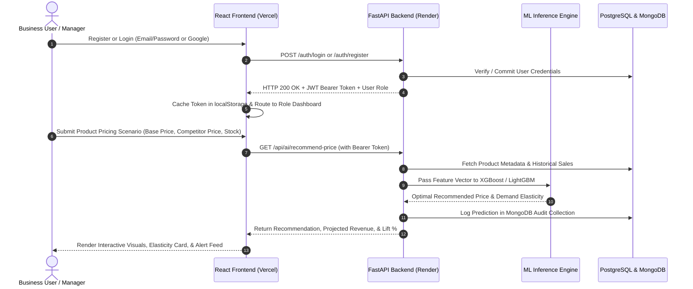
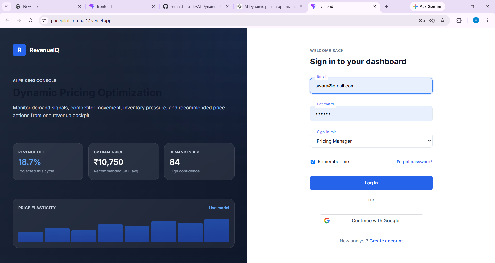
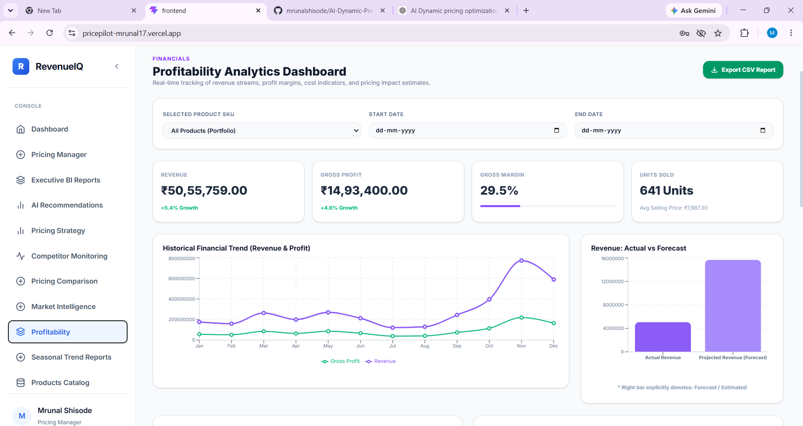

# 🚀 PricePilot AI – Dynamic Pricing Optimization & Revenue Intelligence System

[](https://pricepilot-mrunal17.vercel.app)
[](https://ai-dynamic-pricing-backend.onrender.com)
[](https://ai-dynamic-pricing-backend.onrender.com/docs)
[](https://ai-dynamic-pricing-backend.onrender.com/api/ai/health)

---

## 📌 Live Production URLs

* **Production Web App (Frontend)**: [https://pricepilot-mrunal17.vercel.app](https://pricepilot-mrunal17.vercel.app)
* **Production API Service (Backend)**: [https://ai-dynamic-pricing-backend.onrender.com](https://ai-dynamic-pricing-backend.onrender.com)
* **Interactive Swagger Documentation**: [https://ai-dynamic-pricing-backend.onrender.com/docs](https://ai-dynamic-pricing-backend.onrender.com/docs)
* **Live System Health Check API**: [https://ai-dynamic-pricing-backend.onrender.com/api/ai/health](https://ai-dynamic-pricing-backend.onrender.com/api/ai/health)

---

## 📖 Table of Contents

1. [Project Overview](#1-project-overview)
2. [Problem Statement](#2-problem-statement)
3. [Objectives](#3-objectives)
4. [Key Features](#4-key-features)
5. [Authentication (JWT & Google OAuth)](#5-authentication-jwt--google-oauth)
6. [Admin Dashboard](#6-admin-dashboard)
7. [Pricing Manager Dashboard](#7-pricing-manager-dashboard)
8. [Business Analyst Dashboard](#8-business-analyst-dashboard)
9. [System Architecture](#9-system-architecture)
10. [Project Workflow](#10-project-workflow)
11. [XGBoost Price Prediction](#11-xgboost-price-prediction)
12. [Prophet Demand Forecasting (7-Day, 30-Day, 90-Day)](#12-prophet-demand-forecasting-7-day-30-day--90-day)
13. [Evaluation Metrics (MAE, RMSE, MAPE, R²)](#13-evaluation-metrics-mae-rmse-mape-r)
14. [PostgreSQL & MongoDB Hybrid Persistence](#14-postgresql--mongodb-hybrid-persistence)
15. [Complete Technology Stack](#15-complete-technology-stack)
16. [Project Folder Structure](#16-project-folder-structure)
17. [Local Installation Steps](#17-local-installation-steps)
18. [API Documentation](#18-api-documentation)
19. [Testing & Quality Assurance](#19-testing--quality-assurance)
20. [Deployment Guide (Vercel & Render)](#20-deployment-guide-vercel--render)
21. [Screenshots & Visualizations](#21-screenshots--visualizations)
22. [Future Enhancements](#22-future-enhancements)

---

## 1. Project Overview

**PricePilot AI** is an enterprise-grade, cloud-native Dynamic Pricing Optimization and Revenue Intelligence platform designed to empower modern e-commerce retailers and enterprises with real-time, data-driven pricing intelligence. 

By unifying supervised machine learning (**XGBoost** and **LightGBM**), probabilistic time-series forecasting (**Facebook Prophet**), real-time competitor price intelligence, and role-based operational dashboards, PricePilot AI eliminates guesswork from pricing strategies. The platform continuously monitors sales velocity, inventory levels, market volatility, and competitor behavior to calculate revenue-maximizing prices while maintaining strict profit margin safeguards.

---

## 2. Problem Statement

Traditional retail and e-commerce businesses face critical pricing and demand challenges:

* **Static & Rule-Based Pricing**: Inflexible pricing rules fail to adapt to rapid market changes, customer elasticity, or sudden competitor promotions.
* **Margin Erosion & Price Wars**: Manual repricing is reactive, leading either to margin loss from excessive discounting or lost sales from uncompetitive pricing.
* **Inventory Misalignment**: Lack of synchronization between future demand forecasts and dynamic pricing leads to stockouts of high-velocity items and costly holding fees for slow-moving inventory.
* **Siloed Business Roles**: Administrative engineers, pricing managers, and financial business analysts typically lack a unified data platform, slowing down tactical repricing decisions.

---

## 3. Objectives

* **Predict Revenue-Optimal Prices**: Leverage gradient-boosted decision trees to model multi-variable price elasticity based on cost, inventory, competitor price, and seasonality.
* **Accurate Multi-Horizon Demand Forecasting**: Generate 7-day, 30-day, and 90-day probabilistic forecasts with uncertainty intervals using Facebook Prophet.
* **Automate Competitor Tracking**: Monitor competitor pricing continuously and flag undercut risks via automatic severity alerts.
* **Deliver Role-Based Dashboards**: Provide custom, purpose-built interfaces for Pricing Managers, Business Analysts, and System Administrators.
* **Ensure High Availability & Enterprise Resilience**: Implement a hybrid storage foundation (PostgreSQL + MongoDB Atlas) deployed on cloud infrastructure (Vercel + Render).

---

## 4. Key Features

### 🧠 Intelligent Pricing Engine
* **Dynamic Price Optimization**: Evaluates historical transaction elasticity, current stock, and competitor price signals to output recommended prices with confidence scores.
* **Revenue Uplift Estimation**: Projects expected demand and percentage revenue lift relative to baseline prices.
* **Margin Safeguards**: Hard margin constraints ensure recommended prices never fall below minimum allowable cost thresholds.

### 📈 Multi-Horizon Demand Forecasting
* **7-Day Tactical Forecast**: Short-term daily forecasts for agile repricing, inventory replenishment, and flash promotions.
* **30-Day Operational Forecast**: Monthly demand projection to assist category managers with supplier procurement.
* **90-Day Strategic Forecast**: Quarterly macroeconomic and seasonal trend forecasting for executive planning.
* **Uncertainty Bounds**: Generates 95% confidence intervals (`yhat_lower` to `yhat_upper`) and reliability ratings.

### 🕵️ Competitor Price Intelligence
* **Automated Scraper & Scheduler**: Background APScheduler jobs run automated pricing scans every 6 hours.
* **Market Pressure Index**: Classifies each catalog SKU as *Market Leader*, *Competitive*, *At Risk*, or *Overpriced*.
* **Real-Time Alerts**: Flags price jumps, price drops, and margin threats with severity indicators.

### 📊 Business Intelligence & Financial Analytics
* **Executive KPI Suite**: Real-time tracking of Current Baseline Revenue, Projected Revenue, Revenue Uplift %, and Gross Margin.
* **Interactive Price Elasticity Simulation**: On-the-fly simulation tool allowing managers to adjust demand levels, inventory, and competitor prices to see instant model recommendations.
* **Full Product Lifecycle CRUD**: Product catalog creation, editing, category classification, and inventory tracking.

---

## 5. Authentication (JWT & Google OAuth)

PricePilot AI features a production-hardened dual-authentication system:

* **Email & Password Authentication**:
  * Passwords hashed using industry-standard **PBKDF2-HMAC-SHA256** via `passlib`.
  * Stateless **JSON Web Tokens (JWT)** generated via `python-jose` with HS256 encryption and an 8-hour expiry.
  * Form-level client-side password matching validation and double-click submission guards.
  * Instant auto-login upon registration: newly registered users are issued a JWT immediately and automatically routed to their role-specific dashboard.
* **Google OAuth 2.0 (Google Identity Services - GSI)**:
  * One-tap Sign In with Google utilizing official Google Identity Web SDK.
  * Client-side token decoding combined with server-side signature and audience verification via Google OAuth APIs.
  * Automated account provisioning for verified Google users with default role assignment.
* **Role-Based Access Control (RBAC)**:
  * Strict authorization gates for `Pricing Manager`, `Business Analyst`, and `Admin`.
  * Session credentials stored securely in client `localStorage` with automatic token expiry checks.

---

## 6. Admin Dashboard

The **Admin Control Center** provides platform operators and engineering administrators with complete system oversight:

* **Database Telemetry & Connection Health**: Live status monitors for SQLite (local), PostgreSQL (production transactional), and MongoDB (telemetry).
* **ML Model Registry & Version Tracking**: Active model versioning tracking LightGBM, XGBoost, and Prophet model artifacts, training timestamps, and parameter hashes.
* **Background Scheduler Monitoring**: Job execution history and next scheduled runs for APScheduler jobs (daily demand refresh, weekly retraining, competitor price scans).
* **Audit Logs**: Immutable activity logging capturing authentication events, product creations, catalog updates, and model inference requests.

---

## 7. Pricing Manager Dashboard

The **Pricing Manager Console** is optimized for catalog repricing, margin defense, and competitive strategy:

* **Price Optimization Panel**: Interactive simulation tool where pricing leads select a product, adjust inventory levels, input competitor benchmarks, and receive real-time recommended prices.
* **Elasticity & Revenue Lift Cards**: Visual metrics showing projected unit demand, projected revenue, revenue lift percentage, and algorithm confidence score.
* **Margin Health & Price Alerts**: Real-time alert feed notifying managers when competitors discount matching products or when inventory runs low.
* **Product Catalog Table**: Paginated, searchable, and sortable table with instant editing of base price, cost price, and stock levels.

---

## 8. Business Analyst Dashboard

The **Business Analysis Workspace** gives financial and commercial analysts deep insights into revenue trends and product portfolio performance:

* **Sales Performance Breakdown**: Aggregated sales volume, total revenue, average order value, and revenue trends across categories.
* **Seasonal Trend Analytics**: Historical seasonality decomposition showing monthly demand multipliers, holiday peaks, and cyclical variations.
* **Portfolio Market Intelligence**: Market pressure analytics, classification of products at risk, and competitor price variance charts.
* **Demand Forecast Comparisons**: Multi-horizon forecast tables comparing historical actuals against Prophet forecast curves.

---

## 9. System Architecture

PricePilot AI is architected as a decoupled, multi-tier cloud application:

```mermaid
graph TD
    subgraph Client Tier (Vercel)
        UI[React 19 + Vite SPA]
        Tailwind[Tailwind CSS Design System]
        Recharts[Recharts Visualization Engine]
        GSI[Google Identity Services SDK]
    end

    subgraph API Gateway & Application Tier (Render)
        FastAPI[FastAPI REST API Server]
        CORS[Starlette CORS Middleware]
        Auth[JWT & OAuth2 Security Layer]
        Scheduler[APScheduler Background Worker]
    end

    subgraph AI & ML Intelligence Engine
        XGB[XGBoost Price Prediction Model]
        LGB[LightGBM Price & Demand Regressor]
        ProphetModel[Facebook Prophet Time-Series Engine]
        RecEngine[Revenue Optimization Engine]
    end

    subgraph Persistence & Storage Tier
        Postgres[(PostgreSQL - ACID Relational Store)]
        Mongo[(MongoDB Atlas - Unstructured Telemetry)]
        Artifacts[Joblib / Pickle Model Registry]
    end

    UI -->|HTTPS / REST API| CORS
    GSI -->|OAuth Credential| Auth
    CORS --> FastAPI
    FastAPI --> Auth
    Auth --> FastAPI
    FastAPI --> RecEngine
    RecEngine --> XGB
    RecEngine --> LGB
    RecEngine --> ProphetModel
    FastAPI --> Postgres
    FastAPI --> Mongo
    Scheduler --> Postgres
    Scheduler --> Mongo
```

---

## 10. Project Workflow

The end-to-end operational flow follows this sequence:



---

## 11. XGBoost Price Prediction

The core dynamic pricing engine uses gradient boosted decision trees trained on historical retail transaction records:

* **Algorithm**: `XGBoost Regressor` & `LightGBM Regressor`
* **Dataset**: Online Retail II Dataset (over 680,000 transaction records)
* **Target Feature**: `price` (Optimal Unit Selling Price)
* **Engineered Feature Space (14 Features)**:
  * `stockcode`: Categorical product identifier
  * `quantity`: Units sold in transaction
  * `country`: Geographic customer market
  * `year`, `month`, `week`, `day`, `day_of_week`, `quarter`: Temporal features
  * `quantity_lag_1`, `quantity_lag_7`: Autoregressive sales velocity lags
  * `quantity_rolling_mean_7`, `quantity_rolling_mean_14`: Rolling demand windows
  * `revenue`: Total line-item transaction value
* **Top Feature Importances**:
  1. `quantity_rolling_mean_14` (23.69%)
  2. `quantity_rolling_mean_7` (19.99%)
  3. `quantity_lag_7` (11.48%)
  4. `revenue` (8.01%)
  5. `quantity_lag_1` (6.53%)

---

## 12. Prophet Demand Forecasting (7-Day, 30-Day & 90-Day)

Demand forecasting is powered by **Facebook Prophet**, an additive regression model optimized for business time-series exhibiting non-linear trends and multi-period seasonality:

$$\hat{y}(t) = g(t) + s(t) + h(t) + \epsilon_t$$

* $g(t)$: Piecewise linear growth trend modeling long-term demand changes.
* $s(t)$: Fourier series modeling yearly, quarterly, and weekly seasonality.
* $h(t)$: Holiday and major retail promotional calendar effects.
* $\epsilon_t$: Gaussian error term modeling idiosyncratic demand shocks.

### Multi-Horizon Forecast Breakdown

| Horizon | Granularity | Business Application | Uncertainty Interval |
| :--- | :--- | :--- | :--- |
| **7 Days** | Daily | Dynamic daily pricing, inventory buffer replenishment, flash sale promotions | 95% Confidence Band |
| **30 Days** | Daily / Weekly | Monthly procurement planning, supplier purchase order commitments | 95% Confidence Band |
| **90 Days** | Weekly / Monthly | Quarterly revenue forecasting, seasonal line transition, capital budgeting | 95% Confidence Band |

---

## 13. Evaluation Metrics (MAE, RMSE, MAPE, R²)

Model performance is evaluated using standard statistical and regression metrics:

* **Mean Absolute Error (MAE)**: Measures average absolute magnitude of errors without penalizing outliers.
  $$\text{MAE} = \frac{1}{n}\sum_{i=1}^n |y_i - \hat{y}_i|$$
* **Root Mean Squared Error (RMSE)**: Quadratically penalizes large forecasting errors.
  $$\text{RMSE} = \sqrt{\frac{1}{n}\sum_{i=1}^n (y_i - \hat{y}_i)^2}$$
* **Mean Absolute Percentage Error (MAPE)**: Measures error relative to actual magnitude.
  $$\text{MAPE} = \frac{100\%}{n}\sum_{i=1}^n \left|\frac{y_i - \hat{y}_i}{y_i}\right|$$
* **Coefficient of Determination ($R^2$)**: Proportion of variance explained by the model.
  $$R^2 = 1 - \frac{\sum_{i=1}^n (y_i - \hat{y}_i)^2}{\sum_{i=1}^n (y_i - \bar{y})^2}$$

### Model Performance Benchmark Summary

| Model Name | Task | Dataset | MAE | RMSE | MAPE | $R^2$ Score |
| :--- | :--- | :--- | :--- | :--- | :--- | :--- |
| **XGBoost Regressor** | Price Prediction | Online Retail II | 0.806 | 62.47 | 17.6% | 0.941 (Train) |
| **LightGBM Regressor** | Price Prediction | Online Retail II | **0.490** | **10.39** | **6.4%** | **0.886 (Test)** |
| **Facebook Prophet** | Demand Forecasting | Store Sales Time-Series | 1,117.23 | 1,527.08 | **4.27%** | **0.9056 (Holdout)** |

---

## 14. PostgreSQL & MongoDB Hybrid Persistence

PricePilot AI utilizes a dual-database polyglot persistence architecture:

```
┌─────────────────────────────────────────────────────────────────────────┐
│                      HYBRID PERSISTENCE ARCHITECTURE                    │
├────────────────────────────────────┬────────────────────────────────────┤
│     PostgreSQL (ACID Relational)   │     MongoDB Atlas (Document Store) │
├────────────────────────────────────┼────────────────────────────────────┤
│ • users (Credentials, RBAC Roles)  │ • prediction_logs (Inference Logs) │
│ • products (SKUs, Catalog, Costs)  │ • model_registry (Model Versions)  │
│ • competitor_prices (Active Scans) │ • audit_trail (User & System Logs) │
│ • competitor_price_history         │ • raw_competitor_payloads          │
│ • competitor_alerts (Margin Alerts)│ • features_cache (Feature Snapshots│
│ • monitoring_runs (Batch Tracking) │                                    │
└────────────────────────────────────┴────────────────────────────────────┘
```

* **PostgreSQL Engine**: Managed via SQLAlchemy ORM with automatic connection pooling (`pool_pre_ping=True`) and schema migrations.
* **MongoDB Engine**: Managed via PyMongo with fast failover (`serverSelectionTimeoutMS=2000`) and JSON-native document storage.

---

## 15. Complete Technology Stack

| Layer | Technologies Used |
| :--- | :--- |
| **Frontend Framework** | React 19, Vite 8, JavaScript (ES6+) |
| **Styling & Design System** | Tailwind CSS 4, Custom CSS Design Tokens, Glassmorphism, Dark Mode |
| **Data Visualization** | Recharts, SVG Sparklines, Dynamic Progress Bars |
| **Backend Framework** | FastAPI (Python 3.10+), Starlette, Uvicorn ASGI |
| **Authentication & Security** | JWT (`python-jose`), Passlib (PBKDF2-SHA256), Google Identity Services |
| **Machine Learning & AI** | XGBoost, LightGBM, Facebook Prophet, Scikit-Learn, Pandas, NumPy, Joblib |
| **Relational Database** | PostgreSQL, SQLAlchemy ORM, SQLite (local fallback) |
| **Document Database** | MongoDB Atlas, PyMongo |
| **Scheduling & Automation** | Advanced Python Scheduler (APScheduler) |
| **Cloud Hosting & CI/CD** | Vercel (Frontend SPA), Render (Backend Web Service), GitHub |

---

## 16. Project Folder Structure

```text
AI-Dynamic-Pricing-Optimization-Revenue-Intelligence-System/
│
├── backend/                              # FastAPI Backend Application
│   ├── database/                         # Database connection engines
│   │   ├── postgres.py                   # PostgreSQL SQLAlchemy configuration
│   │   ├── mongodb.py                    # MongoDB PyMongo client configuration
│   │   ├── health.py                     # Multi-database health diagnostics
│   │   └── __init__.py
│   ├── routes/                           # API REST Route Controllers
│   │   ├── ai.py                         # Price recommendation & demand forecast APIs
│   │   ├── dashboard.py                  # Operational dashboard analytics APIs
│   │   ├── competitor_monitoring.py      # Competitor price scraping & alert APIs
│   │   ├── pricing_comparison.py         # Cross-retailer price comparison APIs
│   │   ├── market_intelligence.py        # Market pressure & risk classification APIs
│   │   ├── profitability.py              # Financial & margin analytics APIs
│   │   ├── pricing_strategy.py           # Strategic pricing recommendation APIs
│   │   ├── seasonal_trends.py            # Seasonality decomposition APIs
│   │   └── executive_bi.py               # Executive BI summary report APIs
│   ├── services/                         # Core Business Logic & AI Wrappers
│   │   ├── pricing_service.py            # LightGBM/XGBoost pricing inference service
│   │   ├── forecast_service.py           # Prophet demand forecasting service
│   │   ├── competitor_monitoring_service.py # Competitor scraping & alert engine
│   │   ├── scheduler.py                  # APScheduler background cron tasks
│   │   └── ensure_models.py              # Model artifact bootstrap validator
│   ├── ml_pipeline/                      # ML Training & Evaluation Scripts
│   │   ├── train_price_model.py          # XGBoost / LightGBM model training
│   │   ├── train_prophet.py              # Facebook Prophet model training
│   │   ├── compare_models.py             # Evaluation & benchmarking runner
│   │   └── feature_engineering.py        # Time-series feature engineering
│   ├── saved_models/                     # Serialized Model Artifacts (.joblib, .pkl)
│   ├── datasets/                         # Cleaned training & feature datasets
│   ├── reports/                          # Evaluation metrics & generated plots
│   ├── main.py                           # FastAPI application entry point & CORS
│   └── requirements.txt                  # Python dependencies
│
├── frontend/                             # React + Vite Frontend Application
│   ├── src/
│   │   ├── pages/                        # Specialized Dashboard Pages
│   │   │   ├── AdminDashboard.jsx        # Admin system control & health center
│   │   │   ├── PricingManagerDashboard.jsx # Pricing Manager recommendation console
│   │   │   ├── BusinessAnalystDashboard.jsx # Business Analyst sales & demand workspace
│   │   │   ├── CompetitorMonitoring.jsx  # Competitor price tracking & alerts
│   │   │   ├── ExecutiveBIReports.jsx    # Executive financial KPI dashboard
│   │   │   ├── ForecastVisualization.jsx # Multi-horizon demand forecast charts
│   │   │   ├── MarketIntelligence.jsx    # Market pressure index & risk categories
│   │   │   └── ProfitabilityAnalytics.jsx# Product margin analytics & profitability
│   │   ├── App.jsx                       # Root App, router, & authentication handlers
│   │   ├── apiConfig.js                  # Centralized API base URL resolver
│   │   └── index.css                     # Design system styles & animations
│   ├── public/                           # Static assets, icons, and SVG favicons
│   ├── vercel.json                       # Vercel SPA client-side routing rewrites
│   ├── package.json                      # Node.js dependencies & scripts
│   └── vite.config.js                    # Vite bundler configuration
│
├── database/                             # Root Database Bridge & SQL Schema
│   ├── postgres.py                       # Root bridge module for Render execution
│   ├── mongodb.py                        # Root bridge module for MongoDB
│   ├── health.py                         # Root bridge module for health checks
│   ├── schema.sql                        # PostgreSQL relational DDL schema
│   └── __init__.py
│
├── docs/                                 # Documentation Assets
│   └── screenshots/                      # Architecture diagrams & model plots
│
├── README.md                             # Comprehensive Project Documentation
└── .gitignore                            # Production git exclusions
```

---

## 17. Local Installation Steps

### Prerequisites
* **Python**: `3.10` or higher
* **Node.js**: `18.x` or higher
* **Git**: Installed and configured

### 1. Clone the Repository
```bash
git clone https://github.com/mrunalshisode/AI-Dynamic-Pricing-Optimization-Revenue-Intelligence-System.git
cd AI-Dynamic-Pricing-Optimization-Revenue-Intelligence-System
```

### 2. Backend Setup
```bash
# Navigate to backend directory
cd backend

# Create and activate virtual environment
python -m venv venv
# On Windows:
venv\Scripts\activate
# On macOS/Linux:
source venv/bin/activate

# Install Python dependencies
pip install -r requirements.txt

# Configure environment variables (.env in backend directory)
# Create backend/.env:
SECRET_KEY="your-super-secret-jwt-key"
ALGORITHM="HS256"
FRONTEND_URL="http://localhost:5173"
GOOGLE_CLIENT_ID="your-google-oauth-client-id"
DATABASE_URL="sqlite:///../pricepilot.db"
MONGO_URI="mongodb://localhost:27017/"
MONGO_DB="pricepilot"

# Start FastAPI backend
python -m uvicorn main:app --host 127.0.0.1 --port 8000 --reload
```
*Backend runs at:* `http://127.0.0.1:8000`  
*Swagger API documentation:* `http://127.0.0.1:8000/docs`

### 3. Frontend Setup
```bash
# Open a new terminal and navigate to frontend directory
cd frontend

# Install Node modules
npm install

# Start Vite development server
npm run dev
```
*Frontend runs at:* `http://localhost:5173`

---

## 18. API Documentation

PricePilot AI provides comprehensive RESTful APIs documented interactively via OpenAPI / Swagger.

| Method | Endpoint | Description | Auth Required |
| :--- | :--- | :--- | :--- |
| `GET` | `/api/ai/health` | Multi-database and system health check | No |
| `POST` | `/auth/register` | Register new user & issue JWT bearer token | No |
| `POST` | `/auth/login` | Email/password login & issue JWT bearer token | No |
| `POST` | `/auth/google` | Google OAuth verification & user provisioning | No |
| `GET` | `/dashboard` | Main operational dashboard statistics | **Yes (JWT)** |
| `GET` | `/products` | List all catalog products with current prices | **Yes (JWT)** |
| `POST` | `/products` | Create a new product in the catalog | **Yes (JWT)** |
| `PUT` | `/products/{id}` | Update product price, cost, or inventory | **Yes (JWT)** |
| `DELETE`| `/products/{id}` | Delete a catalog product | **Yes (JWT)** |
| `GET` | `/api/ai/recommend-price` | Compute optimal dynamic price recommendation | **Yes (JWT)** |
| `GET` | `/api/ai/forecast-demand` | Generate multi-horizon Prophet demand forecast | **Yes (JWT)** |
| `GET` | `/api/forecast/{product_id}` | Product-specific forecast with competitor impact | **Yes (JWT)** |
| `GET` | `/api/competitor-monitoring/latest` | Retrieve latest competitor scraped prices | **Yes (JWT)** |
| `GET` | `/api/market-intelligence` | Portfolio market pressure & risk classification | **Yes (JWT)** |
| `GET` | `/api/profitability/overview` | Gross margin & revenue growth analytics | **Yes (JWT)** |
| `GET` | `/api/executive-bi/summary` | Executive high-level KPI and financial summary | **Yes (JWT)** |

---

## 19. Testing & Quality Assurance

The codebase includes automated test suites covering ASGI routing, ML model inference, database health, and CORS preflight.

### Running Backend ASGI Integration Tests
```powershell
python backend/test_combined_service.py
```
*Output: 12/12 PASSED (Validates Browser Root, API Root, Static JS/CSS, Favicon, SPA Fallback, Protected Dashboard API).*

### Running Full End-to-End API Test Suite
```powershell
python backend/test_all_features_e2e.py
```
*Output: 18/18 PASSED (Validates AI Health, Price Prediction, Prophet Forecasting, Executive BI, Competitor Monitoring, and Profitability).*

### Running Frontend Linter & Build Verification
```powershell
cd frontend
npm run lint
npm run build
```

---

## 20. Deployment Guide (Vercel & Render)

### Backend Deployment on Render
1. Create a **Web Service** connected to your GitHub repository.
2. **Environment**: Python 3.
3. **Build Command**: `pip install -r backend/requirements.txt`.
4. **Start Command**:
   ```bash
   python -m uvicorn backend.main:app --host 0.0.0.0 --port $PORT
   ```
5. **Environment Variables**:
   * `FRONTEND_URL`: `https://pricepilot-mrunal17.vercel.app`
   * `SECRET_KEY`: *(Secure random string)*
   * `DATABASE_URL`: *(PostgreSQL connection URI)*
   * `MONGO_URI`: *(MongoDB Atlas connection URI)*
   * `MONGO_DB`: `pricepilot`

### Frontend Deployment on Vercel
1. Import GitHub repository into Vercel.
2. Set **Root Directory** to `frontend`.
3. Framework Preset: **Vite**.
4. **Environment Variables**:
   * `VITE_API_URL`: `https://ai-dynamic-pricing-backend.onrender.com` *(Visibility: Config)*
   * `VITE_GOOGLE_CLIENT_ID`: `your-google-client-id.apps.googleusercontent.com` *(Visibility: Config)*
5. **Deployment Protection**: Ensure *Vercel Authentication* is set to **Disabled / OFF**.

---

## 21. Screenshots & Visualizations

A comprehensive visual gallery of the live PricePilot AI platform across user authentication, role-based dashboards, pricing intelligence, and machine learning analytics.

### 🔐 Login Page & Authentication
*Secure authentication interface supporting Email/Password with JWT sessions and Google OAuth 2.0 (Google Identity Services).*


---

### 📊 Pricing Manager Dashboard
*Interactive pricing workspace enabling managers to lead dynamic pricing decisions, review demand elasticity, and track catalog SKUs.*


#### Product Catalog Management
*Complete SKU catalog overview with inline pagination, search, category filtering, and real-time inventory tracking.*


---

### 💡 Price Prediction & Dynamic Recommendation
*Machine learning pricing recommendation engine estimating revenue lift, optimal price points, and confidence scores based on current stock, competitor prices, and historical elasticity.*


#### Dynamic Pricing Strategy Engine
*Rule-based and model-driven pricing strategy formulation with margin guardrails and elasticity scenarios.*


#### Competitor Pricing Comparison
*Real-time price comparison against competitors across catalog categories with variance benchmarking.*


---

### 📈 Demand Forecasting & Time-Series Analytics
*Interactive demand forecasting workspace comparing historical sales trends against model predictions.*


---

### 💼 Business Analyst & Executive BI Dashboard
*High-level executive business intelligence summarizing baseline revenue, projected revenue uplift, and gross margin health.*


#### Market Intelligence & Risk Classification
*Portfolio market pressure analysis classifying products as Market Leader, Competitive, At Risk, or Overpriced.*


#### Profitability Analytics & Margin Intelligence
*Deep-dive financial analytics tracking gross margin percentage, unit profitability, and cost-to-revenue ratios.*


#### Seasonal Trend Analytics
*Aggregated monthly sales performance and seasonal demand index across product lines.*


#### Real-Time Competitor Price Monitoring
*Automated competitor price tracking, variance analysis, and severity-tagged margin risk alerts.*


---

## 22. Future Enhancements

* **Deep Reinforcement Learning (Q-Learning / PPO)**: Implement multi-agent reinforcement learning for continuous adaptive repricing in simulated competitive duopoly markets.
* **Computer Vision Competitor Matching**: Automatically match identical competitor products across marketplaces using image embeddings and similarity search.
* **E-Commerce Platform Integrations**: Pre-built webhooks and synchronization apps for Shopify, WooCommerce, Amazon Seller Central, and BigCommerce.
* **Real-Time Notification Gateways**: Instant alerts via Slack, Microsoft Teams, and WhatsApp for severe margin erosion risks and inventory stockouts.
* **Multi-Currency & VAT Localization**: Automated currency conversion and localized tax calculations for cross-border international sales.

---

## 👨‍💻 Author & Acknowledgements

* **Developed by**: Mrunal Shisode
* **Repository**: [AI-Dynamic-Pricing-Optimization-Revenue-Intelligence-System](https://github.com/mrunalshisode/AI-Dynamic-Pricing-Optimization-Revenue-Intelligence-System)
* **License**: MIT Open Source License
